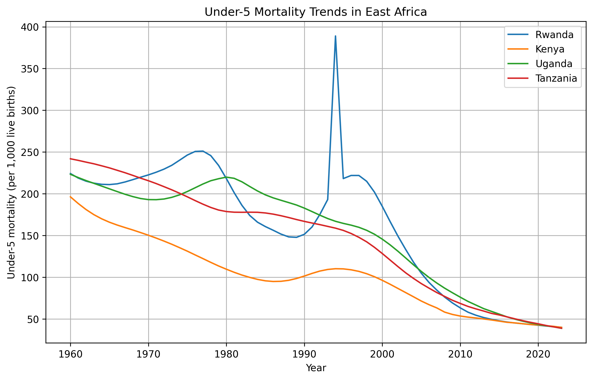
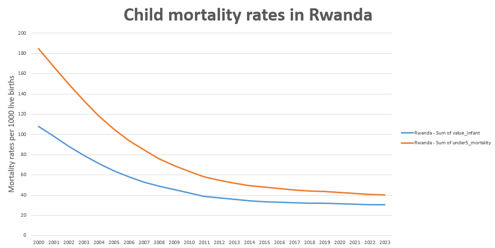

# Maternal and Child Mortality Analysis

## Overview

This project analyzes maternal, infant, and under-5 mortality trends across countries using publicly available datasets. The goal is to compare under-5 children mortality rates between East African states, to check whether there is a connection between maternal mortality rates and infant mortality rates across the world, and to analyse child mortality trends in Rwanda from 2000.

The analysis was done using Python, Pandas, Matplotlib and Excel, with cleaned and merged datasets prepared for visualization.

## Datasets

-Maternal Mortality – Maternal deaths per 100,000 live births

-Infant Mortality – Infant deaths per 1,000 live births

-Under-5 Mortality – Deaths of children under 5 per 1,000 live births

(All datasets were downloaded from the World Bank/UN public health repositories and cleaned for analysis.)

## Tools & Libraries

`Python 3`
`Pandas (data cleaning and manipulation)`
`Matplotlib (visualizations)`
`Jupyter/Colab notebooks`

## Project structure

- `data/`            # data files
- `notebook/`        # python scripts
- `figures/  `       # generated visualizations
- `README.md`

## Analysis and insights

    Under-5 Mortality Trends in East Africa

-Steady decline is observed in Rwanda, Kenya, Uganda, and Tanzania over the last two decades. 

-In 1994, the rates spiked due to the Genocide against the Tutsi.

-After 1994, Rwanda shows the biggest improvement, reflecting effective child health policies.

    Maternal mortality rates

-(Found many inconsistent data from the dataset and chose to leave this indicator out of this analysis)

     Child  Mortality trends in Rwanda (2000-2023) 

-Consistent decline is obvious in child mortality rates in Rwanda. This indicates a strong effect of the government's health policies

-In 2000, reported infant mortality rates were 107.9 per 1000 births. In 2023, the reported rates were 30.5 per 1000 births.

-In 2000, reported under-5 mortality rates were 184.9 per 1000 births. In 2023, the reported rates were 40 per 1000 births.

